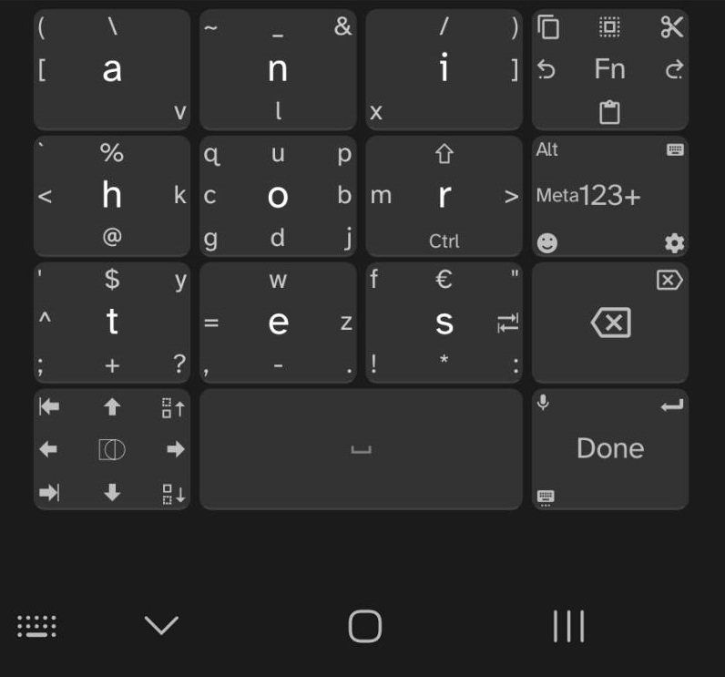
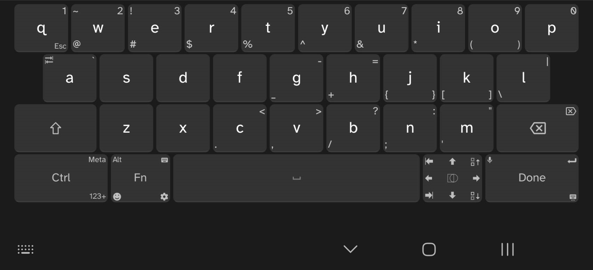
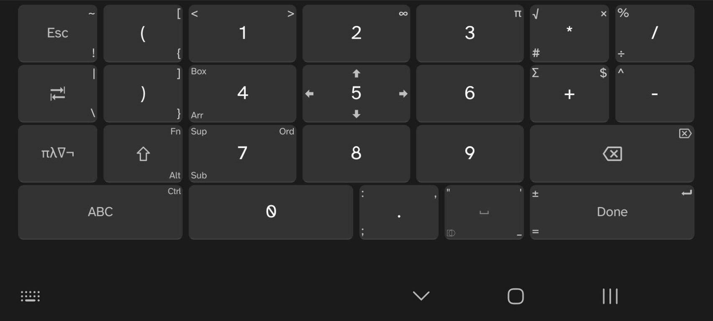

## Unexpected Keyboard Custom Layouts

MessagEase and a tweaked QWERTY (US) layouts that work together. MessagEase is best for vertical, one handed orientations. QWERTY for landscape.

The QWERTY layout is an adjusted form of the bundled QWERTY (US) layout to be more consistent with the MessagEase layout. It is strongly recommended to use both of these layouts together.

Both layouts allow you to flip/flop between the two as well as launch the Android keyboard picker so you can easily swap between MessagEase, QWERTY (US) within Unexpected Keyboard and switch to a different keyboard as appropriate.

## Adding to Unexpected Keyboard

To use these layouts you can copy/paste the contents of the `xml` files into the Unexpected Keyboard custom layout editor.

## KemoNine's Personal Config

**Layout**

- Layout 1: KmN QWERTY (US)
- Layout 2: KmN MessagEase

**Add keys to the keyboard**

- Disable all but...
- Alt
- Meta
- Tab
- Esc
- Page Up
- Page Down
- Home
- End
- Switch Keyboard
- F11
- F12

- Disable `Show number row`
- `Show NumPad` set to `Never`
- `NumPad layout` set to `Low digits first`
- Tweak `Swiping distance` as needed / desired
- `Circle gesture sensitivity` set to `Disabled`
    - Circle gestures can be fiddly, enable if you feel they work for you
- Enable `Double tap on shift for caps lock`
- `Custom Vibration` set to `50ms`
- Enable `Pin entry layout`
- Adjust margins as needed / desired

## Additional Info

### Resources

- https://github.com/Julow/Unexpected-Keyboard
- https://github.com/Julow/Unexpected-Keyboard/blob/master/doc/Custom-layouts.md
- https://github.com/Julow/Unexpected-Keyboard/blob/master/doc/Possible-key-values.md
- https://unexpected-keyboard-layout-editor.lixquid.com/

### Screenshots

#### MessagEase
(note: the `#` symbol was added to the layout *after* the screen shot was taken. it is located on the `r` key in the upper right corner)

#### QWERTY

#### Standard Numeric Layer
(built in / cannot be changed)

